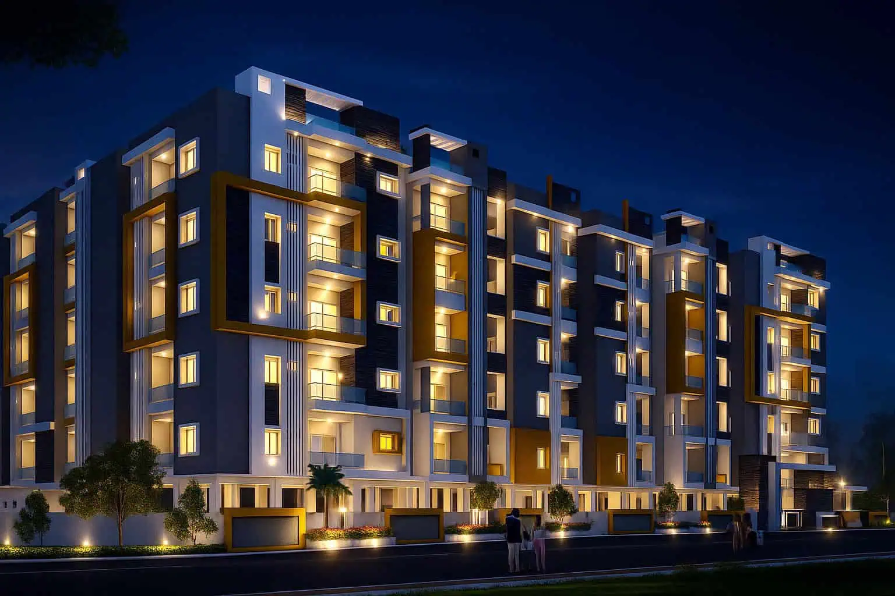

# 🏡 Oxygen Homes — Ultra-Luxury Real Estate Landing Page

A high-converting, luxury-aesthetic web application designed for **Oxygen Homes** in North-West Hyderabad (Bachupally & Pragathi Nagar). Engineered with architectural elegance, frictionless lead capture funnels, and real estate marketing automation.



---

## 🌟 Key Highlights & Fetched Details

- **Official Project Location:** [Oxygen Homes Experience Centre, Pragathi Nagar / Bachupally, Hyderabad](https://maps.app.goo.gl/fKTbFS54ejikUcjLA)
- **Flagship Projects:**
  - **Oxygen City:** 99 Signature Triplex Luxury Villas (G+2, 168 & 200 Sq. Yds., East & West facing) in Mallampet – Bachupally.
  - **Oxygen Pearl:** 3.07-Acre High-Rise Gated Community (2 & 3 BHK, 1,135 – 2,600 Sft) in Pragathi Nagar.
- **Statutory Approvals:** HMDA Approved & TS-RERA Registered (`P02200003461`).
- **Google Reviews:** 4.8 ★ / 5.0 ★ rating with verified buyer testimonials.

---

## ⚡ High-Conversion & Encashment Features

1. **Above-the-Fold Lead Magnet:** Instant pre-launch pricing and layout brochure unlock form.
2. **Sticky Conversion Bar:** Persistent mobile & desktop bar with 1-click calling, WhatsApp VIP concierge, and site visit booking.
3. **Interactive Master Floor Plan Explorer:** Toggle between 168 & 200 Sq Yd East/West triplex villas and 3-BHK apartment layouts.
4. **Dynamic EMI & 5-Year Capital Appreciation Calculator:** Real-time sliders for loan amount, rate, and tenure with projected 5-year capital gains in the Bachupally IT corridor.
5. **Real-Time Social Proof Activity Ticker:** Live simulated buyer booking notifications to drive FOMO and urgency.
6. **Exit-Intent Retention:** Captures abandoning visitors with an exclusive ₹3,00,000 early bird voucher.
7. **Secret Admin Lead Vault (`Ctrl + Shift + L`):** Built-in dashboard to view all captured leads and export directly to CSV/Excel.

---

## 🛠️ Tech Stack

- **HTML5 & Modern Semantic Web**
- **Tailwind CSS** (via CDN with custom luxury color scheme: Deep Emerald, Obsidian Slate, Champagne & Brushed Gold)
- **Lucide Icons**
- **Vanilla JavaScript (ES6+)** — Zero build dependencies, instantaneous load time, and 100% static hosting compatibility.

---

## 🚀 Live Preview & Deployment

To run locally:
```bash
# Python simple server
python -m http.server 8080
```
Open [http://localhost:8080](http://localhost:8080) in your browser.

Deployable directly to **GitHub Pages**, **Vercel**, **Netlify**, or **AWS S3 / CloudFront**.

---

© 2026 Oxygen Homes. Crafted for High Lead Conversion & Prestige Living.
